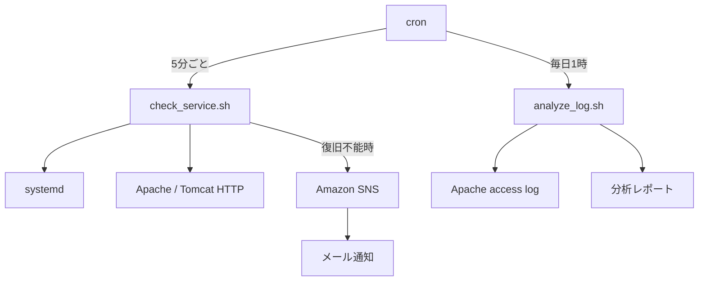

# Linux Service Monitor (Apache / Tomcat)

[](https://github.com/ABFishyang/linux-service-monitor/actions/workflows/shellcheck.yml)

Amazon Linux 2023上のApache HTTP Server / Tomcatを対象に、稼働監視・自動復旧・障害通知・アクセスログ分析を行うシェルスクリプト群です。ミドルウェア運用における「死活監視 → 自動復旧 → 通知 → ログ調査」の流れを個人学習として実装・検証しました。

## 構成



## check_service.sh

- `systemctl is-active` によるプロセス死活確認
- `curl` によるHTTPレベルの応答確認（プロセスが生きていても実際に応答するか検証）
- 異常検知時は自動で `systemctl restart` を実行し、再確認
- 再起動後も復旧しない場合のみ、Amazon SNS経由でメール通知
- 全ての判定結果を `/var/log/service-monitor.log` に記録

## analyze_log.sh

- Apache access logからHTTPステータスコード分布を集計
- アクセス数上位のクライアントIPを集計
- 4xx/5xxエラーリクエストの詳細を抽出
- 結果を `/var/log/access-log-report.log` に出力

## 実行環境・技術要素

- Amazon Linux 2023 / systemd / cron (cronie)
- Bash（awk / grep -E / 配列 / パラメータ展開）
- AWS CLI / IAM Role（`sns:Publish`）/ Amazon SNS
- Apache HTTP Server 2.4 / Tomcat 10.1.x（Java 17 / Amazon Corretto）
- GitHub Actions / ShellCheck

## セットアップ

1. Apache / Tomcatをインストールし、systemdサービスとして登録
2. スクリプトを `/usr/local/bin` に配置し、実行権限を付与
3. IAM Role（`sns:Publish`権限）をEC2インスタンスにアタッチ
4. SNSトピックを作成し、メールサブスクリプションを登録・確認
5. `/etc/service-monitor.env` に環境固有の設定を保存
6. rootのcrontabに定期実行を登録

```bash
sudo install -m 0755 check_service.sh analyze_log.sh /usr/local/bin/

sudo tee /etc/service-monitor.env >/dev/null <<'EOF'
SNS_TOPIC_ARN=arn:aws:sns:ap-northeast-1:123456789012:service-alert
AWS_REGION=ap-northeast-1
EOF
sudo chmod 0600 /etc/service-monitor.env

sudo crontab -e
# 以下を登録
*/5 * * * * /usr/local/bin/check_service.sh >> /var/log/service-monitor-cron.log 2>&1
0 1 * * * /usr/local/bin/analyze_log.sh >> /var/log/analyze-log-cron.log 2>&1
```

`SNS_TOPIC_ARN` が未設定の場合、自動復旧とログ記録は続行し、SNS通知のみをスキップします。ARNやアカウントIDはリポジトリへコミットしないでください。

## 静的解析

push / pull request時にGitHub ActionsでShellCheckを実行します。ローカルでは次のコマンドで同じ検査を実行できます。

```bash
shellcheck check_service.sh analyze_log.sh
```

## 検証済みの障害シナリオ

| シナリオ | 検知方法 | 結果 |
|---|---|---|
| プロセスが`kill -9`で強制終了 | `systemctl is-active` | 自動再起動で復旧、通知なし |
| 設定ファイル破損により起動不能 | `systemctl is-active` + `curl` | 再起動失敗を検知、SNS通知を送信 |
| HTTPステータス403をエラーと誤判定 | 実運用検証で発覚 | 判定ロジックを「000以外は生存」に修正 |

詳細な障害対応記録は [RUNBOOK.md](./RUNBOOK.md) を参照。

## 個人学習について

本プロジェクトは求職活動における個人学習として実施したものであり、実務経験ではありません。
